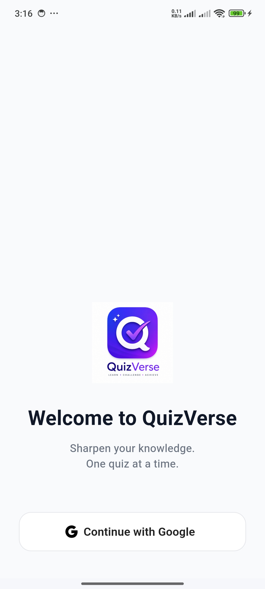
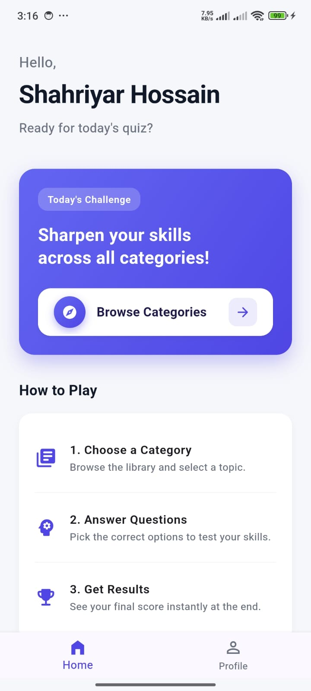
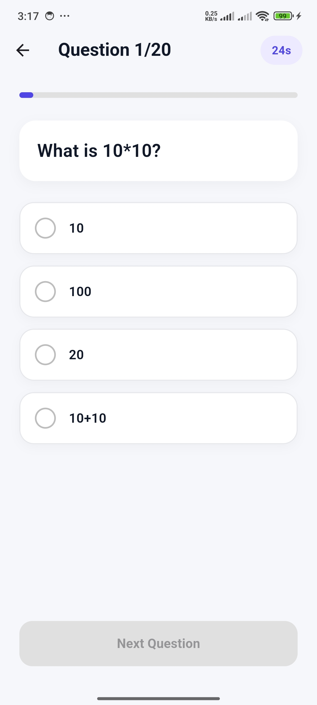
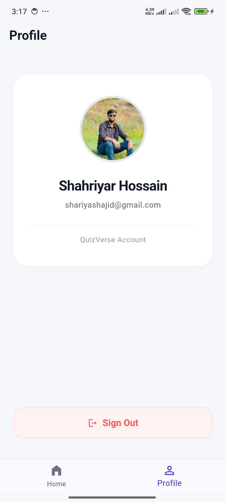

# QuizVerse - Flutter Quiz Application

A complete, feature-rich Flutter Quiz Application built for the Module 5 Assignment. Users can sign in with Google, explore various quiz categories, participate in timed challenges, and view their final results.

## 🚀 Features
- **Google Authentication:** Secure sign-in using Firebase Authentication.
- **API Integration:** Dynamic quiz data fetched from external REST APIs using `http`.
- **Category Browsing:** Browse and select from multiple unique quiz categories.
- **Interactive Quiz Flow:** Smooth question transitions with a built-in timer.
- **Dynamic Profile:** Personalized user experience displaying name, email, and photo.
- **Clean Architecture:** Organized structure separating data, logic, and presentation layers.

## 📸 Screenshots
| Login Page | Home Page | Quiz Page | Result Page | Profile Page |
| :---: | :---: | :---: | :---: | :---: |
|  |  |  |  |  |

*(Note: Ensure your screenshots are named correctly in the `screenshots/` folder)*

## 🛠 Tech Stack
- **Framework:** Flutter
- **Language:** Dart
- **Backend/Auth:** Firebase Authentication (Google Sign-In)
- **Networking:** `http` package
- **Architecture:** MVVM-inspired Clean Architecture

## 📋 Getting Started

### Prerequisites
- Flutter SDK installed
- Android Studio / VS Code
- A Firebase project configured for this app

### Installation
1. Clone the repository:
   ```bash
   git clone <your-repository-url>