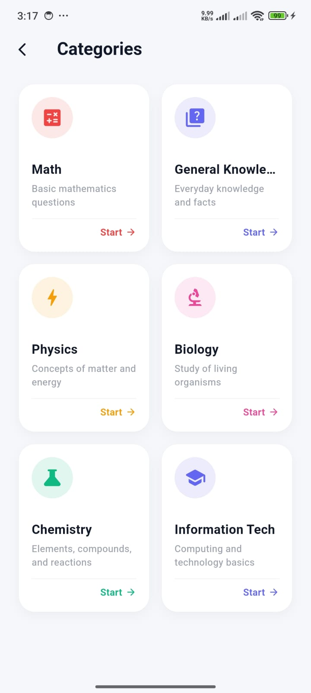
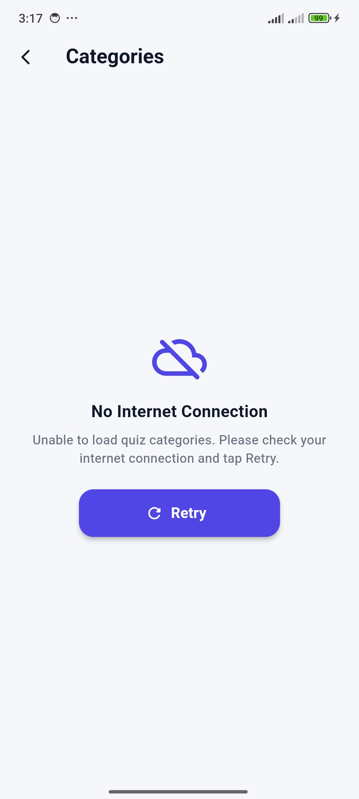

# QuizVerse - Flutter Quiz Application

A modern Flutter quiz application developed for the Module 5 Assignment. The app uses Google Authentication, retrieves quiz data from REST APIs, and provides an interactive timed quiz experience with a clean, responsive UI.

---

## 🚀 Features

- Google Authentication using Firebase
- REST API integration with the `http` package
- Dynamic quiz categories
- Timed quiz with countdown timer
- Automatic score calculation
- Interactive result screen
- User profile with Google account information
- Internet connection error handling with Retry option
- Responsive and modern UI
- Clean project structure

---

## 📸 Screenshots

| Login | Home | Category |
|:---:|:---:|:---:|
|  |  |  |

| Quiz | Result | Profile |
|:---:|:---:|:---:|
|  |  |  |

| Error Handling |
|:---:|
|  |

---

## 🛠 Tech Stack

- Flutter
- Dart
- Firebase Authentication
- Google Sign-In
- HTTP Package
- Material Design 3

---

## 📂 Project Structure

```
lib/
│
├── core/
│   └── services/
│
├── data/
│   └── models/
│
├── presentation/
│   ├── screens/
│   └── widgets/
│
└── app.dart
```

---

## 📋 Getting Started

### Prerequisites

- Flutter SDK 3.24+
- Dart SDK
- Android Studio or VS Code
- Firebase Project configured
- Android SDK

### Installation

Clone the repository

```bash
git clone <your-repository-url>
```

Go to the project directory

```bash
cd actual_quiz_app
```

Install dependencies

```bash
flutter pub get
```

Run the application

```bash
flutter run
```

Build Release APK

```bash
flutter build apk --release
```

---

## 🌐 API Used

Categories

```
GET /api/v1/categories
```

Questions

```
GET /api/v1/categories/{categoryId}/questions
```

---

## 📦 Dependencies

- firebase_core
- firebase_auth
- google_sign_in
- http
- provider
- cached_network_image

---

## 👨‍💻 Author

**Shariyar Hossain Durjoy**

Department of Computer Science & Engineering

Rajshahi University of Engineering & Technology (RUET)

---

## 📄 License

This project was developed for educational purposes as part of the Flutter Module 5 Assignment.